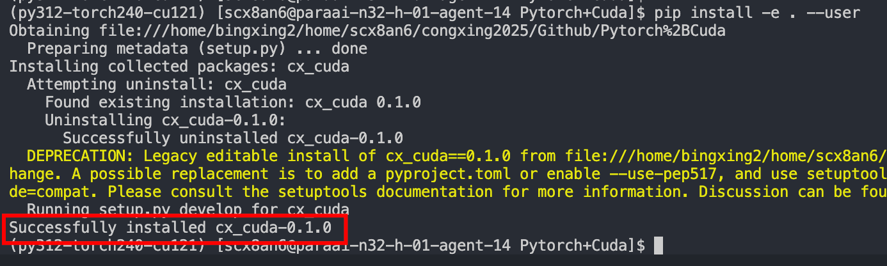
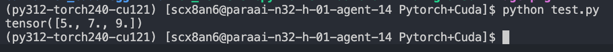

##  Pytorch-Cuda

一个用于构建Pytorch直接调用Cuda算子的框架demo

### 1-框架结构

```text
- Project
    - src                       # 用于存储cpp和cuda源代码文件
        - binding.cpp           # 将C接口和Python接口进行绑定
        - kernel
            - kernels.cu        # 内核实现文件
    - setup.py                  # 使用 setuptools 和 PyTorch 的扩展工具，将包含 C++ 和 CUDA 的源文件编译为可以通过 Python 导入的模块
    - test.py                   # 通过 python 传入 torch 的 tensor 格式数据，即可使用 C++/CUDA 代码
    - README.md                 # 说明文档
    ##########生成的内容##########
    - build                     # 运行 python setup.py build 后生成的构建文件夹
    - XX.egg-info               # 一些库的说明
    - XX.cpython-XX-XX-XX-XX.so # 链接库
```

### 2-编译运行

```shell
python setup.py build
```

这条命令使用 setup.py 中定义的构建规则，执行扩展模块的构建流程。具体行为如下：
- 调用 setuptools 的 build 命令；
- 由 cmdclass={'build_ext': BuildExtension} 指定使用 PyTorch 的 BuildExtension 替代默认行为；
- 会编译所有在 CUDAExtension 中指定的源文件（如 .cpp 和 .cu 文件），生成共享对象 .so 文件；
- 构建产物默认保存在 build/ 目录下。
适用于仅查看或测试构建是否成功，但不会安装模块。

```shell
pip install -e . --user
```

这条命令使用 pip 安装当前目录（.）下的模块，含义如下：
- -e 表示“editable mode”，即“开发模式安装”：
- 安装的是指向源码目录的软链接，而不是复制源码；
- 修改源码后无需重新安装，适合开发调试；
- . 表示当前目录，即当前目录下的 setup.py 被用作安装入口；
- --user 指安装到用户主目录下的 Python 路径中（如 ~/.local/lib/...），不需要管理员权限。

**适用于开发期间频繁修改源码并希望即时反映变更**。


### 3-执行效果






